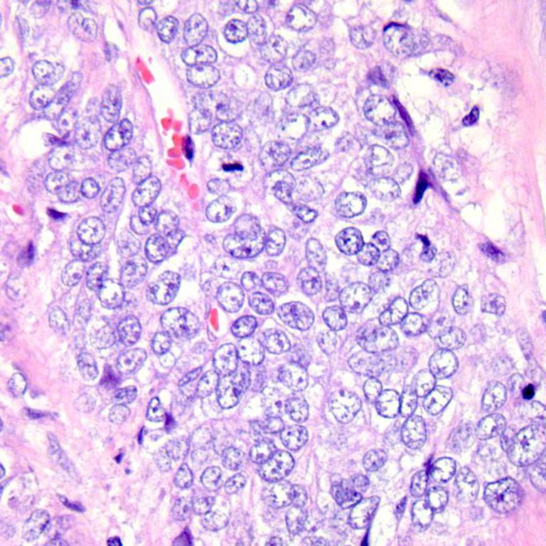

# praktikum-pengolahan-citra-7-mei

Nama: Ica Rizqiah

Nim: 312410554

Kelas: I241E

---

## 📝 Deskripsi Proyek
Proyek ini merupakan implementasi dan analisis komparatif dari algoritma pendeteksian tepi (Edge Detection) pada citra medis (dataset Kanker). Proyek ini dibagi menjadi tiga tugas utama:
1. **Tugas 1:** Implementasi fungsi konvolusi dan operator Sobel secara manual (dari *scratch*).
2. **Tugas 2:** Analisis *Parameter Sweep* pada metode Canny dan perbandingannya dengan Sobel.
3. **Tugas 3:** Pembuatan aplikasi Web Interaktif menggunakan Streamlit.

---

## 🚀 Fitur & Analisis

### 1️⃣ Tugas 1: Sobel Edge Detection (Manual)
Pada bagian ini, deteksi tepi dilakukan dengan membangun fungsi konvolusi 2D secara mandiri menggunakan `numpy` dengan *padding reflect*. 
* **Metode:** Menggunakan kernel Gx (horizontal) dan Gy (vertikal) berukuran 3x3.
* **Evaluasi:** Hasil Sobel manual dibandingkan dengan fungsi `cv2.Sobel` bawaan OpenCV, dan tingkat kemiripannya diukur menggunakan **RMSE (Root Mean Square Error)**.

   

### 2️⃣ Tugas 2: Canny Parameter Sweep
Eksperimen ini bertujuan untuk melihat sensitivitas metode Canny terhadap perubahan parameter.
* **Dataset:** 3 citra medis kanker dengan karakteristik berbeda (kontras rendah, noise, dll).
* **Visualisasi:** Menggunakan **Heat Map** (berwarna *Purples*) untuk memetakan jumlah piksel tepi yang terdeteksi pada berbagai kombinasi *Low Threshold* dan *High Threshold*.
* **Hasil:** Semakin rendah nilai threshold, program menjadi semakin sensitif dan mendeteksi lebih banyak garis tepi (noise ikut terdeteksi).

### 3️⃣ Tugas 3: Streamlit Web App 🐈
Aplikasi web interaktif dengan antarmuka yang ramah pengguna.
* **Fitur:** - *Upload* gambar citra medis secara langsung.
  - *Slider* interaktif untuk mengatur parameter Sobel (Kernel Size, Threshold) dan Canny (Sigma, Low/High Threshold).
  - Statistik *real-time* (Waktu Komputasi, Jumlah Tepi, Edge Density).
  - Fitur unduh (Download) hasil gambar deteksi tepi.

---

## 🛠️ Cara Menjalankan Aplikasi (How to Run)

1. Pastikan Python sudah terinstall di komputermu.
2. Clone repository ini ke komputer lokal.
3. Buka terminal dan arahkan ke folder proyek.
4. Install semua *library* yang dibutuhkan dengan perintah berikut:
   ```bash
   pip install opencv-python numpy matplotlib scikit-image Pillow streamlit
Untuk menjalankan Web App (Tugas 3), ketik perintah ini di terminal:

Bash
streamlit run app.py
Dibuat dengan 💜 dan ☕ untuk Tugas Pengolahan Citra Digital.
--- Metrik untuk colonca1.jpeg ---
sobel_edge_pixels: 356664
canny_edge_pixels: 69325
sobel_time_ms: 11.4654 ms
canny_time_ms: 1.9177 ms
sobel_edge_density: 0.6047
canny_edge_density: 0.1175

Memproses gambar: colonca1009.jpeg

--- Metrik untuk colonca1009.jpeg ---
sobel_edge_pixels: 240663
canny_edge_pixels: 33362
sobel_time_ms: 11.3354 ms
canny_time_ms: 1.3183 ms
sobel_edge_density: 0.4080
canny_edge_density: 0.0566

Memproses gambar: colonn1020.jpeg

--- Metrik untuk colonn1020.jpeg ---
sobel_edge_pixels: 235187
canny_edge_pixels: 34997
sobel_time_ms: 10.4950 ms
canny_time_ms: 1.1904 ms
sobel_edge_density: 0.3987
canny_edge_density: 0.0593
